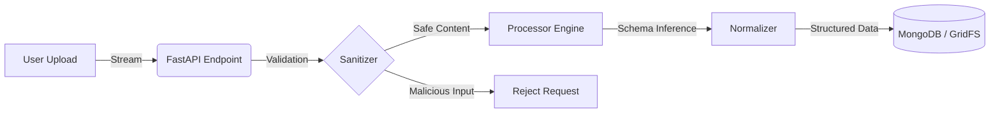

# CSV Ingestion & Processing Engine

### Backend-Focused Full Stack Application (FastAPI + MongoDB GridFS)

<p align="left">
  
  
  
  
  
  
</p>

> **A secure, compliance-oriented engine for ingesting, sanitizing, and normalizing CSV files at scale.**

Built to handle heterogeneous schemas, enforce **LGPD data protection**, and protect against CSV Injection, providing a backend-centric architecture suitable for production environments.

## Project Purpose

This system was originally developed to solve a real business problem: users frequently uploaded CSV files with inconsistent structures, repeated keys, missing fields, or schema drift. Existing online tools could not be used due to:

* **LGPD/compliance restrictions**
* **Sensitive client data**
* **Lack of ownership/control over data processing**
* **No guarantees of CSV Injection protection**
* **Inability to infer schemas or normalize data safely**

### ✔ What the engine does

It performs secure ingestion and converts unstructured CSV key-value patterns into proper, user-friendly tables.

| Raw Input (Messy) | Engine Process | Structured Output (Clean) |
| :--- | :---: | :--- |
| `Name, John` <br> `Age, 23` <br> `City, NY` | **1. Sanitization** <br> **2. Schema Inference** <br> **3. Normalization** | **Table: Users** <br> `[ { "name": "John", "age": 23, "city": "NY" } ]` |

### ✔ Why this matters

This allows teams to:

* Analyze inconsistent data sources
* Generate structured tables automatically
* Avoid dangerous online tools that leak data
* Comply with LGPD and other regulations
* Prepare data for analytics or migration pipelines

---

## Architecture & Design

This application is designed with a **Backend-first** mindset, following clean, modular design and production-grade patterns.

### System Flow



### Key Backend Engineering Decisions

| Decision | Rationale |
| -- | -- |
| FastAPI + Async I/O (Motor) | High throughput for file-heavy workloads |
| MongoDB + GridFS | Stores arbitrarily large CSVs and avoids RAM bottlenecks |
| Schema Inference Engine | Converts inconsistent key-value patterns into relational tables |
| CSV Injection Sanitization | Prevents spreadsheet attacks (=, +, @, -) |
| Test suite (unit + integration) | Ensures correctness for processors, sanitizers, and API |

### Project Structure

```text
backend/
├── app/
│   ├── main.py              # FastAPI entrypoint
│   ├── api/v1/              # REST endpoints
│   ├── services/            # Core business logic
│   │   ├── csv_processor.py # Schema inference & transforms
│   │   ├── sanitize.py      # Security layer
│   │   └── storage.py       # GridFS IO abstraction
│   ├── db/mongo.py          # Database connection
│   └── models/              # Pydantic data models
```

---

## Quick Start

Run the entire stack (API + Database) locally using Docker.

### Prerequisites

* Docker & Docker Compose
  
#### 1. Run the application

```bash
docker-compose up -d --build
```

#### 2. Access the Interfaces

* **Web UI:** http://localhost:3000 (if frontend is included)
* **API Documentation (Swagger):** http://localhost:8000/docs

---

## Features

### 🛡 Security

* LGPD-friendly processing (no third-party tools)
* CSV Injection protection
* File size limit (50 MB)
* Strict content-type validation
* Sanitized metadata stored separately from raw file streams

### 🧠 Automated CSV Processing

* Dynamic schema generation
* Delimiter autodetection
* Normalization of inconsistent key-value patterns
* Type guessing & field correction
* Detailed logs of anomalies and processing events

### 📦 Storage (MongoDB GridFS)

* Resilient storage for large CSVs
* Metadata + structured output stored as documents
* Supports large file ingestion without memory overload

### 🔁 CI/CD

* GitHub Actions (tests + Docker build)
* Isolated modules for pipeline execution
* Reproducible environment via Docker Compose

<!--

---

### Demonstration:
1. Secure Upload

Users upload files via a clean interface with immediate validation.
2. Automated Processing

The system ingests, cleans, and presents the data.

Upload Flow


Processed Table Preview


GIF Demo


---

-->

## Documentation

For detailed implementation guides, please refer to:

* 
* 
* 
* 
* 

---

## Roadmap (Planned Backend Enhancements)

These align with real-world ingestion & data engineering pipelines:

* [] **Chunked Processing:** for huge datasets
* [] **RFC 4180 Compliance:** Stricter CSV parsing.
* [] **Export Options:** Convert to Parquet/JSON/XLSX.
* [] **Data analysis** & pattern detection
* [] **Background Workers:** Celery + Redis for async processing.
* [] **RBAC:** User roles and permissions.

---

## License

Distributed under the MIT License.
