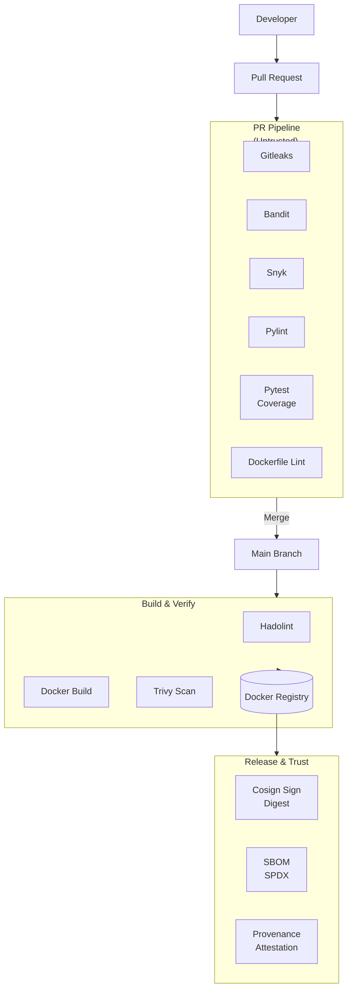

# CI/CD Pipeline Documentation

This document describes the CI/CD architecture, security controls, and
Supply-chain guarantees are implemented in this project.

The pipeline is designed to provide **fast developer feedback**, **strong security gates**, and **cryptographically verifiable release artifacts**, and aligns with **SLSA Level 3**.

---

## Pipeline Goals 🎯

The CI/CD system is intentionally designed around **trust separation** and **progressive assurance**.

**Primary goals:**

- Fast, blocking feedback on Pull Requests
- Prevent insecure code from reaching `main`
- Ensure reproducible, auditable container builds
- Establish cryptographic trust only at release time
- Provide verifiable provenance for released artifacts

---

## Pipeline Stages Overview 🧩

The pipeline is divided into three independent stages, each with increasing trust and responsibility.

| Stage | Trigger | Purpose |
|------|-------|---------|
| PR Pipeline | Pull Request | Security & quality gates |
| Build Pipeline | Push to `main` | Build & verify artifacts |
| Release Pipeline | Git tag (`vX.Y.Z`) | Signing, SBOM & provenance |

## CI/CD Architecture Diagram

Logical View (Control Flow + Trust Boundaries)



---

### 1️⃣ PR Pipeline — Fast & Blocking

Trigger: `pull_request → main`

This stage prevents insecure or low-quality code from entering the trusted codebase.

#### Executed Steps

- **Secret Scanning:** Gitleaks
- **Static Analysis:** Bandit (high severity, high confidence)
- **Linting:** Pylint (minimum score enforced)
- **Testing:** Unit + Integration tests (pytest)
- **Coverage Gate:** Enforced via coverage.py + Codecov
- **Infrastructure Linting:** Hadolint (Dockerfiles)

#### Guarantees

- ✔ No leaked credentials
- ✔ No known high-risk Python vulnerabilities
- ✔ Code quality thresholds enforced
- ✔ Functional correctness validated

---

### 2️⃣ Main Branch Pipeline (Build & Verify)

Trigger: `push → main`

This stage produces container artifacts **without establishing trust**.

#### Executed Steps

- Reproducible container builds (Docker BuildKit)
- Registry push (Docker Hub)
- Vulnerability scanning (Trivy — HIGH / CRITICAL fail)

#### Guarantees

- ✔ Deterministic, repeatable builds
- ✔ No critical vulnerabilities at build time
- ✔ Artifacts are unsigned and untrusted

---

### 3️⃣ Release Pipeline (Trust & Provenance)

**Trigger:** Git tag (`vX.Y.Z`)

This stage establishes cryptographic trust and supply-chain integrity.

#### Executed Steps

- Keyless image signing (`Cosign` + `GitHub OIDC`)
- Digest-pinned signing (no mutable tags)
- SBOM generation & attestation (SPDX)
- SLSA provenance attestation (GitHub native)

#### Guarantees

- ✔ Artifact authenticity is cryptographically verifiable
- ✔ Dependencies are fully enumerated
- ✔ Provenance binds source → build → artifact
- ✔ Trust is only granted to reviewed, tagged releases

---

## Supply‑Chain Security Controls 🔐

| Control            | Tool                |
| ------------------ | ------------------- |
| Secret Scanning    | Gitleaks            |
| SAST               | Bandit              |
| SCA                | Snyk                |
| Code Quality       | Pylint              |
| Container Linting  | Hadolint            |
| Container Scanning | Trivy               |
| Image Signing      | Cosign (OIDC)       |
| SBOM               | Syft                |
| Provenance         | GitHub Attestations |

---

## SLSA Mapping 🧠

This pipeline aligns with SLSA Level 2 and partially satisfies Level 3 controls.

### SLSA Level 1 – Build Process

- ✔ Fully automated build via GitHub Actions

### SLSA Level 2 – Build Service

- ✔ Version-controlled pipelines
- ✔ Authenticated source
- ✔ Tamper-resistant build steps

### SLSA Level 3 – Hardened Builds (Partial)

- ✔ Isolated, ephemeral GitHub runners
- ✔ Review-based source control
- ✔ Digest-pinned signing
- ✔ Cryptographic provenance
- ✔ Verifiable SBOM attestations

📄 Full audit explanation: [`docs/slsa.md`](https://github.com/agslima/csv-schema-evolution/blob/main/docs/slsa.md)

<!--
---

## CI/CD Architecture Diagram 🏗️

```text
Developer
   |
   |  Pull Request
   v
+--------------------+
|   PR Pipeline      |
|--------------------|
| Gitleaks           |
| Bandit             |
| Pylint             |
| Pytest + Coverage  |
+--------------------+
          |
          | Merge
          v
+--------------------+
| Main Branch CI     |
|--------------------|
| Hadolint           |
| Docker Build       |
| Trivy Scan         |
+--------------------+
          |
          | Git Tag (vX.Y.Z)
          v
+--------------------+
| Release Pipeline   |
|--------------------|
| Cosign Signing     |
| SBOM (Syft)        |
+--------------------+
          |
          v
   Trusted Artifact
```
-->

---

## Key Design Decisions 📌

- Separation of PR, build, and release trust boundaries
- Security scans fail fast to reduce feedback time
- Digest-based signing to prevent tag mutation attacks
- Keyless OIDC signing to avoid long-lived secrets
- Provenance attached at release, not build time
- SBOM generation enables compliance (LGPD, SOC‑2, ISO‑27001)

---

## Future Improvements 📈

- Hermetic builds with fully pinned dependencies
- Policy enforcement (admission control / OPA)
- Runtime signature verification
