# CI/CD Pipeline Documentation

This document explains the Continuous Integration and Continuous Delivery (CI/CD) pipeline used in this project, the security guarantees it provides, and how it maps to the SLSA (Supply-chain Levels for Software Artifacts) framework.


---

##  Pipeline Goals 🎯

The CI/CD pipeline is intentionally designed with clear trust boundaries, fast developer feedback, and strong supply‑chain security guarantees.

**Primary goals:**

* Fast, blocking feedback on Pull Requests
* Strong security gates before artifacts are built
* Cryptographically verifiable release artifacts
* Clear separation between build and release responsibilities

---

## Pipeline Stages Overview 🧩

The pipeline is divided into three independent stages, each with increasing trust and responsibility.

| Stage | Trigger |	Purpose |
| --- | --- | --- |
| PR Pipeline |	Pull Request |	Fast validation & security gates |
| Main Branch Pipeline | Push to main |	Build & verify container artifacts |
| Release Pipeline |	Git tag (vX.Y.Z) | Artifact signing & provenance |

## CI/CD Architecture Diagram

Logical View (Control Flow + Trust Boundaries)

```mermaid
flowchart TB
    subgraph Dev["Developer"]
        A[Git Push / PR]
    end

    subgraph GitHub["GitHub Repository"]
        B[Pull Request]
        C[Main Branch]
        D[Version Tag vX.Y.Z]
    end

    subgraph CI["GitHub Actions – CI"]
        subgraph PR["PR Pipeline (Fast & Blocking)"]
            P1[Gitleaks<br/>Secret Scanning]
            P2[Bandit<br/>Python SAST]
            P3[Snyk<br/>Dependency Scan]
            P4[Pylint<br/>Code Quality Gate]
            P5[Pytest<br/>Unit & Integration Tests]
            P6[Codecov<br/>Coverage Enforcement]
        end

        subgraph Build["Build & Verify"]
            B1[Hadolint<br/>Dockerfile Lint]
            B2[Docker Build]
            B3[Push Image<br/>Docker Hub]
            B4[Trivy<br/>Container Scan]
        end

        subgraph Release["Release & Trust"]
            R1[Cosign<br/>Image Signing]
            R2[SBOM Generation<br/>SPDX]
        end
    end

    subgraph Registry["Artifact Registry"]
        I1[(Docker Hub)]
    end

    %% Flow
    A --> B
    B --> PR
    PR -->|Merge| C
    C --> Build
    D --> Build
    Build --> I1
    I1 --> Release
```



---

### 1️⃣ PR Pipeline (Fast, Blocking)

Trigger: `pull_request → main`

This stage protects the codebase by preventing insecure or low-quality code from being merged.

**Executed Steps**

* **Secret Scanning:** Gitleaks
* **Static Analysis:** Bandit (high severity, high confidence)
* **Linting:** Pylint (minimum score enforced)
* **Testing:** Unit + Integration tests (pytest)
* **Coverage Gate:** Enforced via coverage.py + Codecov

**Guarantees**

* No secrets committed
* No known high‑risk Python vulnerabilities
* Code quality threshold enforced
* Functional correctness validated

---

### 2️⃣ Main Branch Pipeline (Build & Verify)

Trigger: `push → main`

This stage builds deployable artifacts but does not yet establish trust.

**Executed Steps**

* Dockerfile Linting: Hadolint
* Container Build: Docker BuildKit
* Container Registry Push: Docker Hub
* Vulnerability Scan: Trivy (HIGH / CRITICAL block)

**Guarantees**

* Reproducible container builds
* No critical vulnerabilities at build time
* Artifacts are verified but unsigned

---

### 3️⃣ Release Pipeline (Trust & Provenance)

**Trigger:** Git tag (`vX.Y.Z`)

This stage establishes artifact trust and supply‑chain integrity.

**Executed Steps**

* Image Signing: `Cosign` (cryptographic signature)
* SBOM Generation: `Syft` (SPDX‑JSON)

**Guarantees**

* Image authenticity is cryptographically verifiable
* Full dependency inventory available
* Immutable, auditable release artifacts

---

## Supply‑Chain Security Controls 🔐

| Control | Tool |
| --- | --- |
| Secret Scanning | Gitleaks |
| SAST (Python) | Bandit |
|Linting | Pylint, Hadolint |
| Dependency Analysis | Trivy |
| Image Signing | Cosign |
| SBOM | Syft |

---

## SLSA Mapping 🧠

This pipeline aligns with SLSA Level 2 and partially satisfies Level 3 controls.

**SLSA Level 1 – Build Process**

✔ Fully automated build via GitHub Actions

**SLSA Level 2 – Build Service**

✔ Version‑controlled pipeline ✔ Authenticated source (GitHub) ✔ Tamper‑resistant build steps

**SLSA Level 3 – Hardened Builds (Partial)**

⚠️ Isolated runners (GitHub‑hosted) ⚠️ No hermetic builds yet ✔ Signed artifacts (Cosign) ✔ Provenance metadata (SBOM)

> Current Level: SLSA 2 (strong)

Path to Level 3: Self‑hosted runners, hermetic builds, provenance attestations

---

## CI/CD Architecture Diagram 🏗️

```text
Developer
   |
   |  Pull Request
   v
+--------------------+
|   PR Pipeline      |
|--------------------|
| Gitleaks           |
| Bandit             |
| Pylint             |
| Pytest + Coverage  |
+--------------------+
          |
          | Merge
          v
+--------------------+
| Main Branch CI     |
|--------------------|
| Hadolint           |
| Docker Build       |
| Trivy Scan         |
+--------------------+
          |
          | Git Tag (vX.Y.Z)
          v
+--------------------+
| Release Pipeline   |
|--------------------|
| Cosign Signing     |
| SBOM (Syft)        |
+--------------------+
          |
          v
   Trusted Artifact
```

---

## Key Design Decisions 📌

* Separation of trust levels prevents PRs from producing trusted artifacts
* Security scans fail fast to reduce feedback time
* Signing only on release avoids accidental trust escalation
* SBOM generation enables compliance (LGPD, SOC‑2, ISO‑27001)

---

## Future Improvements 📈

* SLSA provenance attestations (cosign attest)
* Hermetic builds with pinned dependencies
* Admission policy enforcement (Kubernetes / OPA)
