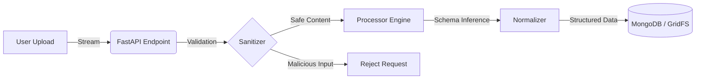

# CSV Ingestion & Processing Engine

## Backend‑First Data Ingestion Service (FastAPI + MongoDB GridFS)

<p align="left">
  <a href="https://github.com/agslima/csv-schema-evolution/actions/workflows/01-pr-validation.yml">
    
  </a>
  <a href="https://github.com/agslima/csv-schema-evolution/actions/workflows/02-delivery.yml">
    
  </a>
  <a href="https://github.com/agslima/csv-schema-evolution/actions/workflows/codeql.yml">
    
  </a>
  <a href="https://codecov.io/github/agslima/csv-schema-evolution" >
    
  </a>
  <!--<a href="https://www.bestpractices.dev/projects/11596">
    
  </a>-->
  <a href="https://github.com/agslima/csv-schema-evolution/actions/workflows/02-delivery.yml">
    
  </a>
  
  
    
  
</p>

> **A backend‑centric engine for securely ingesting, sanitizing, and normalizing heterogeneous CSV files.**

This project focuses on **data safety, correctness, and operational transparency**. It was designed to process sensitive CSV files **without relying on third‑party online tools**, ensuring full control over data handling and compliance requirements.

## TL;DR

- Secure backend service for ingesting untrusted CSVs
- Focused on compliance, sanitization, and observability
<!--- Designed for real production pipelines, not ad-hoc scripts-->
- Best entry points: `/docs/architecture.md` and `/docs/processing-engine.md`

## Problem Statement

In real production environments, CSV files are rarely clean or standardized. Users frequently upload files with:

- Inconsistent schemas and repeated keys
- Missing or optional fields
- Unknown delimiters and quoting rules
- Data that may trigger **CSV / Formula Injection** when opened in spreadsheet software

Existing online CSV tools were **not an option** due to:

- LGPD and data protection constraints
- Sensitive client information
- Lack of transparency in processing pipelines
- No guarantees around sanitization or secure storage

This system was designed to address these issues in a **controlled and auditable backend service**.

---

## How to run this? 🚀

### Prerequisites

- Docker & Docker Compose

#### 1. Clone the repository

```bash
git clone https://github.com/agslima/csv-schema-evolution.git
cd csv-schema-evolution
```

#### 1. Run the Stack

```bash
docker-compose up -d --build
```

#### 2. Access the Interfaces

- **Web UI:** http://localhost:3000
- **API Docs (Swagger):** http://localhost:8000/docs

---

<!--

## Screenshots

| Upload CSV | Processed Table Preview |
|---|---|
|  |  |
| **GIF Demo** |
| |

### Demonstration:

1. Secure Upload

Users upload files via a clean interface with immediate validation.

2. Automated Processing

The system ingests, cleans, and presents the data.
Upload Flow


Processed Table Preview


3. GIF Demo


---
-->

## What the Engine Does

The engine ingests unstructured or semi‑structured CSV files and converts them into **normalized, user‑friendly tabular data**.

| Raw Input                       | Processing Stages                                                   | Structured Output                             |
| ------------------------------- | ------------------------------------------------------------------- | --------------------------------------------- |
| `Name; John``Age, 23``City, NY` | Sanitization → Dialect Detection → Schema Inference → Normalization | `{ "name": "John", "age": 23, "city": "NY" }` |

### Key Outcomes

- Safe ingestion of untrusted CSV files
- Automatic schema inference without user configuration
- Protection against spreadsheet‑based attacks
- Structured output suitable for analytics, migration, or reporting pipelines

---

## High‑Level Architecture

The system adheres to **Clean Architecture** principles, featuring a clear separation between API, business logic, and infrastructure.



### Design Tradeoffs

- **FastAPI + async I/O** for high concurrency during file uploads
- **MongoDB GridFS** was chosen to simplify transactional consistency between file storage and metadata during early ingestion stages, with future support for object storage planned.
- **Heuristic dialect detection** to avoid forcing users to configure CSV formats
- **Encryption at rest** to minimize exposure of sensitive data

> [!NOTE]
> When **dialect detection** confidence falls below a defined threshold, the engine **fails fast** with an explicit error rather than producing ambiguous output.

Detailed architecture documentation is available in `/docs`.

---

## API Overview  

| Method | Endpoint                      | Description                              |
| ------ | ----------------------------- | ---------------------------------------- |
| POST   | `/api/v1/files/upload`        | Upload, sanitize, and process a CSV file |
| GET    | `/api/v1/files/`              | List uploaded files and metadata         |
| GET    | `/api/v1/files/{id}/download` | Download decrypted CSV                   |
| DELETE | `/api/v1/files/{id}`          | Permanently delete file and metadata     |
| GET    | `/api/v1/health`              | Liveness check (legacy)                  |
| GET    | `/api/v1/health/live`         | Liveness check                           |
| GET    | `/api/v1/health/ready`        | Readiness check (Mongo + GridFS)         |

Full request/response payloads and error models are documented in `docs/api-reference.md`.

---

## Health Checks

- Liveness: `/api/v1/health/live` (or `/api/v1/health` for legacy) returns `{"status":"ok"}`.
- Readiness: `/api/v1/health/ready` returns dependency status and responds with `503` when Mongo/GridFS is unavailable.
- Docker Compose: backend healthcheck calls `/api/v1/health/ready` (see `docker-compose.yml`).

### Kubernetes probes (example)

```yaml
livenessProbe:
  httpGet:
    path: /api/v1/health/live
    port: 8000
  initialDelaySeconds: 10
  periodSeconds: 10

readinessProbe:
  httpGet:
    path: /api/v1/health/ready
    port: 8000
  initialDelaySeconds: 10
  periodSeconds: 10
```

---

## Security & Compliance (Summary)

Security is enforced **by design**, not as an afterthought:

- Encryption at rest using AES (Fernet)
- Strict file type and size validation (default 50MB)
- Active mitigation of CSV / Formula Injection (`=`, `+`, `-`, `@`)
- No third‑party data processing services
- Clear separation between raw file storage and metadata

The system is designed with LGPD principles in mind, including **data minimization**, **purpose limitation**, and **access control**. Full details are available in `docs/security.md`.

---

## Testing & Quality

The project is developed using **Test-Driven Development (TDD)** and maintains **high test coverage** across all critical paths, with exclusions explicitly documented in the boilerplate.

Test levels include:

- Unit tests for core algorithms (dialect detection, sanitization)
- Integration tests covering full HTTP request lifecycles
- Storage and database interaction tests

Coverage is continuously measured via **Codecov** and enforced in CI. See `docs/testing.md` for details.

---

## CI/CD & Supply Chain Security

The CI/CD pipeline is designed to detect security issues early and ensure **artifact integrity** across the entire build lifecycle.

Every commit and pull request triggers an automated workflow that performs:

- **Secret Scanning** — Prevents accidental leakage of credentials and sensitive values before code is merged.
- **Static Analysis & Dependency Scanning** — Identifies vulnerable dependencies and insecure code patterns in both application code and third‑party libraries.
- **Automated Testing & Coverage Enforcement** — Ensures correctness, guards against regressions, and enforces coverage thresholds.
- **Container Hardening** — Validates Dockerfiles and scans container images for known vulnerabilities.
- **Artifact Integrity & Provenance** — Built images are signed and accompanied by a Software Bill of Materials (SBOM).

This pipeline reduces supply‑chain risk and provides the traceability required for security reviews and compliance audits.

<details><summary>Tooling used</summary>
  
- Secret scanning: Gitleaks
- SAST / SCA: Snyk, Bandit, Pylint  
- Test coverage: Pytest + Codecov  
- Docker linting: Hadolint  
- Container scanning: Trivy  
- Image signing: Cosign  
- SBOM generation: Syft

</details>

---

## Observability

The application implements structured logging with request correlation IDs, enabling full traceability across API, service, and storage layers.

Example:

```text
[INFO] [req_id: 1234] Request started: POST /api/v1/files/upload
[INFO] [req_id: 1234] Detected dialect: delimiter="," quote="\""
[ERROR] [req_id: 1234] Failed to write to GridFS: ConnectionTimeout
```

Logging configuration and operational guidance are documented in `docs/logging.md`.

---

## Documentation Index

For detailed implementation guides, please refer to:

- 📡 API Reference — [`docs/api-reference.md`](https://github.com/agslima/csv-schema-evolution/blob/main/docs/api-reference.md)
- 🏗 Architecture — [`docs/architecture.md`](https://github.com/agslima/csv-schema-evolution/blob/main/docs/architecture.md)
- ⚙ Processing Engine — [`docs/processing-engine.md`](https://github.com/agslima/csv-schema-evolution/blob/main/docs/processing-engine.md)
- 🔁 CI/CD & Supply Chain Security — [`docs/ci-cd.md`](https://github.com/agslima/csv-schema-evolution/blob/main/docs/ci-cd.md)
- 🔒 Security & Compliance — [`docs/security.md`](https://github.com/agslima/csv-schema-evolution/blob/main/docs/security.md)
- 🧪 Testing Strategy — [`docs/testing.md`](https://github.com/agslima/csv-schema-evolution/blob/main/docs/testing.md)
- 📝 Logging & Observability — [`docs/logging.md`](https://github.com/agslima/csv-schema-evolution/blob/main/docs/logging.md)
- 🚀 Setup & Installation Guide — [`docs/setup.md`](https://github.com/agslima/csv-schema-evolution/blob/main/docs/setup.md)
  
---

## Roadmap

Planned enhancements aligned with real ingestion pipelines:

- Chunked processing for large datasets
- RFC 4180‑compliant parsing
- Export formats (Parquet, JSON, XLSX)
- Background workers (Celery + Redis)
- Role‑based access control (RBAC)

<!--
---
## Contributing 

1. ​Fork the project
2. ​Create your Feature Branch (`git checkout -b feature/AmazingFeature`)
3. ​Commit your changes (`git commit -m 'Add some AmazingFeature'`)
4. ​Push to the Branch (`git push origin feature/AmazingFeature`)
5. ​Open a Pull Request
-->
---

## License

This project is licensed under the MIT License. See the LICENSE file for details.
